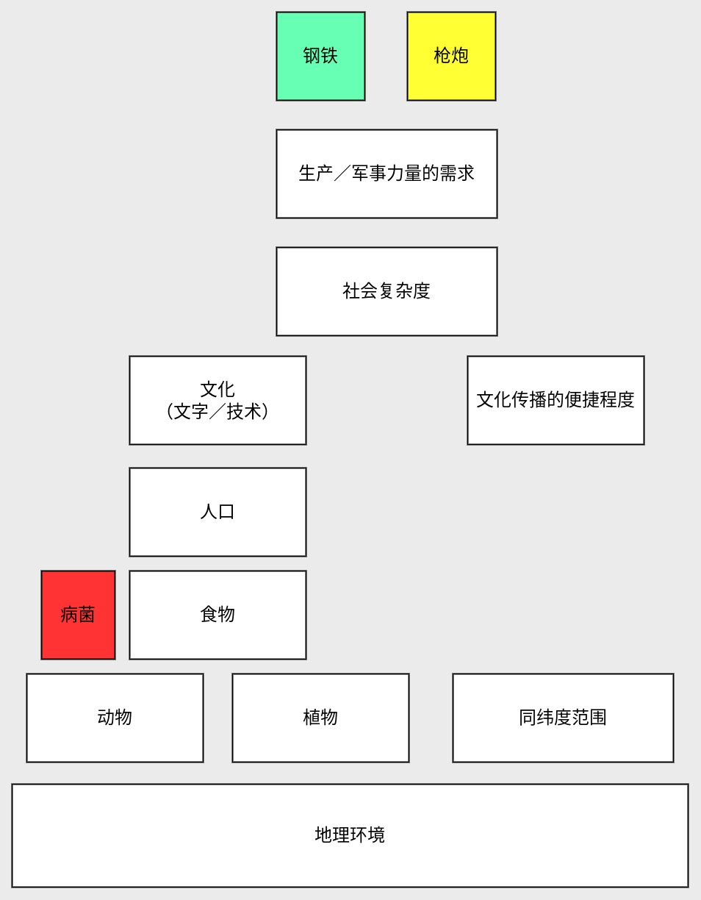

很久前就看到这本畅销书，趁着清明节假期路上空闲翻阅一下，百闻不如一见，确实长了点见识。
我将根据[如何阅读一本书](/a/117.html)的阅读方法，来总结本书。

<!-- more -->

## 本书的内容
阐述各大陆（或各国家）的地理环境如何影响该地区的社会发展。

## 如何论述
提问的主要问题：
- 是因为各大洲的人类智力不同导致该地区发展速度和水平不一致么？
- 为什么是欧洲征服美洲？
- 为什么欧亚大陆的地区普遍比其它大陆更早起步或发展更快？

为了解答这些问题，作者以3种东西作为媒介，也就是书本的标题：枪炮／病菌／钢铁。作者认为它们是社会发展水平的标识，也是欧洲征服美洲的关键要素。然而这些都只是近因，研究产生这些近因的远因才能真正了解人类历史的发展规律。
这里我以图表的方式来表达，越往下层则是越本质的远因，反之则是越容易被看到的近因。
暂时无法在文档外展示此内容

从上图可以看出，枪炮／钢铁与病菌这些影响社会发展的因素，最终是由地理环境这个本质根源导致的。
书中则是通过从远因如何引起一层层往上引起各个近因的差异，最终导致各大陆上的国家或地区发展不平衡的。以下简单概述下各层的关系：
- 地理环境影响各个大陆的动植物差异性，包括丰富度和驯化难度；
- 动植物越丰富且驯化越容易，则食物越多，越能养活更多的人；
- 人多了则产生更多的文化需求，如文字／技术；
- 另外文化的传播依赖文化生长环境的差异性，同纬度的差异性更小，所以传播更便捷；
- 社会复杂度则在文化和人口达到一定程度时出现，从原始族群到国家，最终以国家为终点；
- 国家的出现意味着生产和军事需求达到目前顶峰，促使钢铁／枪炮的出现。
有了这些结论，就可以解答上述问题了。如果从地理上来看，问题的关键就在于欧亚大陆为何比美洲大陆强。在比较两个大陆的地理环境的动植物差异／纬度范围，可以看出欧亚大陆都比美洲大陆强。所以生活在欧亚大陆的人类才有能力征服美洲的。

## 这本书是否真实？
作者说的有道理吗？部分还是全部？
我也是认同这种时势造英雄的论调的。

## 这本书对我的启发
- 从宏观的角度分析历史发展的整体规律，使我对“人类历史学”有了初步的认识。
- 历史学的规律适用在大范围或长周期内，这也是这门学问的特性。
- 近因往往是模糊／复杂且不通用的，远因／根源往往是清晰／简单且通用的。
