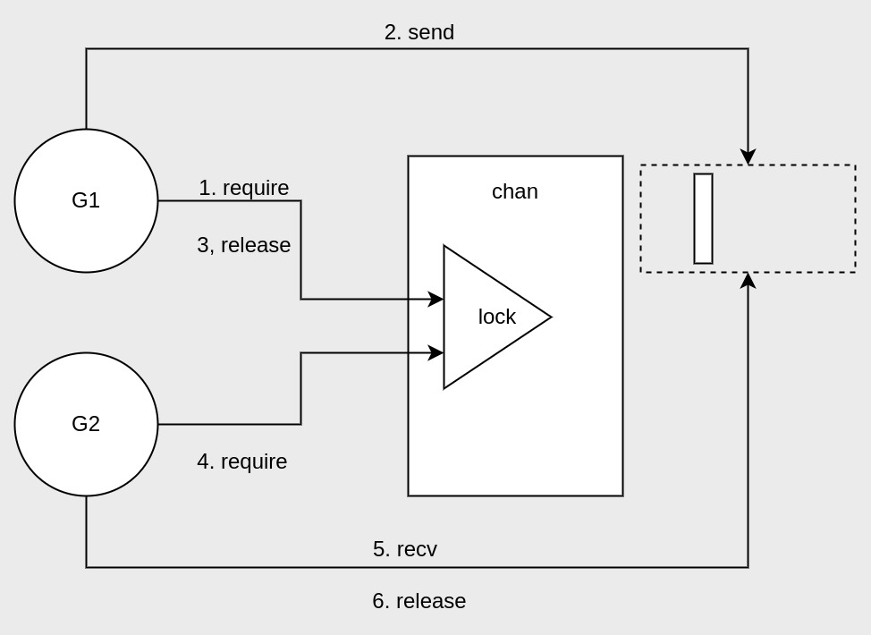
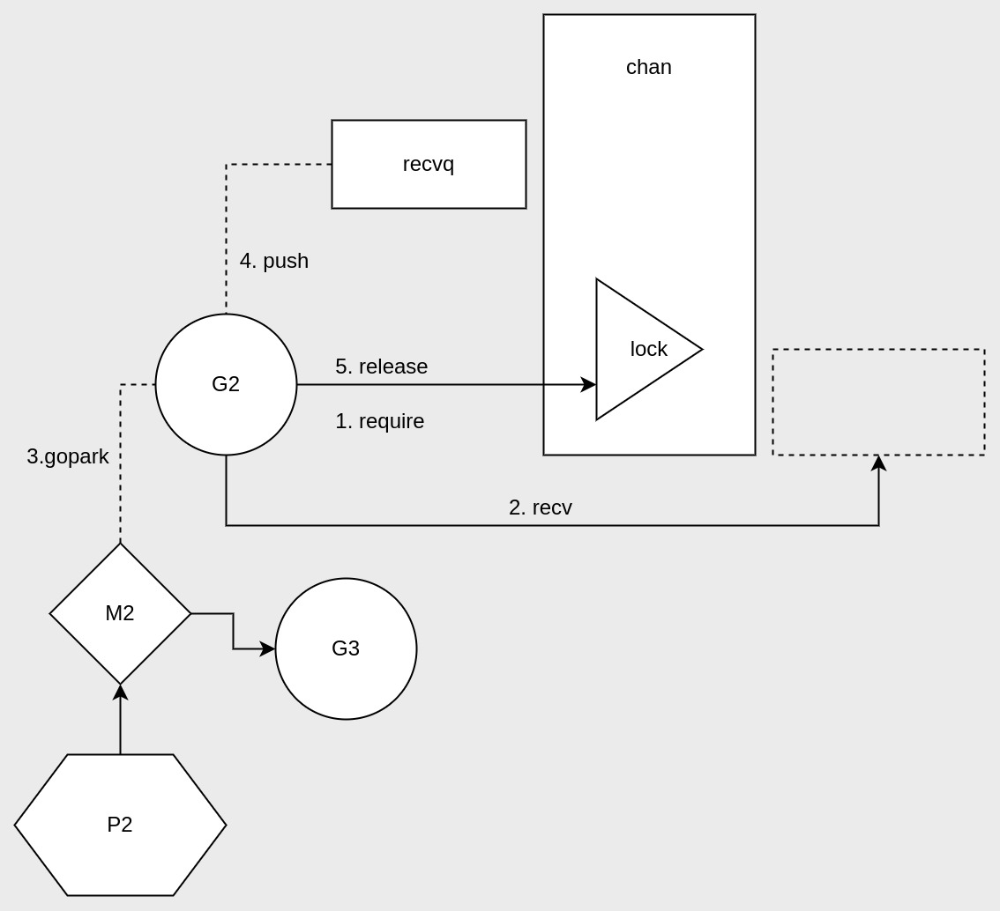
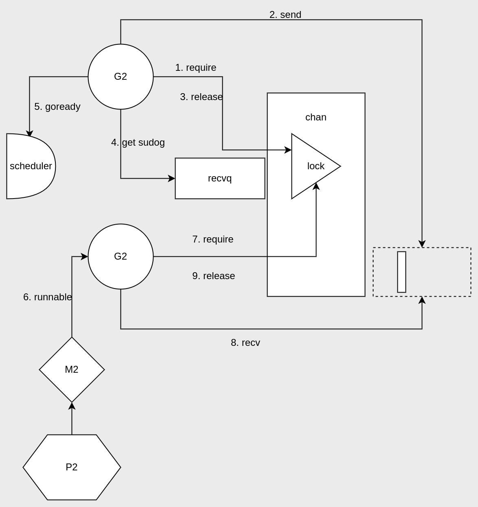
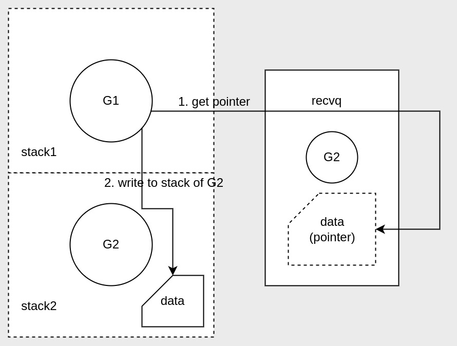

上次说到了channels使用的[注意事项](https://www.cwalker.top/a/131.html)，这次来聊聊它的原理。

<!-- more -->

## channels底层结构
channels在Go源码中是用结构体封装构建的，当make一个chan时，返回的是它的结构体指针。
```go
type hchan struct {
        qcount   uint           // total data in the queue
        dataqsiz uint           // size of the circular queue
        buf      unsafe.Pointer // points to an array of dataqsiz elements
        elemsize uint16
        closed   uint32
        elemtype *_type // element type
        sendx    uint   // send index
        recvx    uint   // receive index
        recvq    waitq  // list of recv waiters
        sendq    waitq  // list of send waiters

        // lock protects all fields in hchan, as well as several
        // fields in sudogs blocked on this channel.
        //
        // Do not change another G's status while holding this lock
        // (in particular, do not ready a G), as this can deadlock
        // with stack shrinking.
        lock mutex
}
```

核心字段的说明：
- buf是一个指向存储channels数组的指针；
- sendx, recvx分别是当前发送和接收所在的数组索引，索引到达末尾后又会重头开始，说明数组是环形的；
- lock是一个互斥锁，用于控制数组的读写并发，这也是chan具有goroutine安全特性的原因；
- recvq, sendq分别用于接收和发送者的等待队列；

## 发送／接收的流程



1. 发送者G1先获取到chan的lock，
2. Ｇ1往chan环形数据中放了数据；
3. G1释放了chan的locak；
4. 接收者G2需要从chan中拿数据，所以也要获取chan的lock；
5. 然后G2从chan中读取了数据；
6. G2读完数据后释放了chan的lock；

如果反过来是接收者G2先从空的chan尝试读数据呢？
这就需要说到接收和发送队列了。

## chan如何导致goroutine阻塞的？



### 从空的chan中读数据
- 读数据的goroutine会被阻塞，具体是它调用了gopark将自己与线程M解绑，好让其与P中的其它goroutine绑定执行其它任务。
- 然后G2封装成sudog并放入recvq中。

### 如何从阻塞中恢复



得让chan有数据，然后被阻塞的接收者才能恢复。
- 发送者G1在发送完数据后，获取了recvq的sudog，并向scheduler发送了goready信号恢复G2的调度；
- G2这才会阻塞中恢复，并成功读取到数据。

同理，如果是在满了的chan中发数据，也会阻塞，恢复也需要靠接收者，只不过是把recvq换成sendq。

## chan阻塞传输的性能优化
在阻塞后传输的过程中，chan做了点优化，减少数据的拷贝消耗，特别是在无缓冲chan上，可以完全避免chan数组的数据拷贝。

### 跨goroutine栈的读写
这个就是优化的手段了。具体实现如下：



## 参考
- [understanding channels](https://speakerdeck.com/kavya719/understanding-channels?slide=56)

