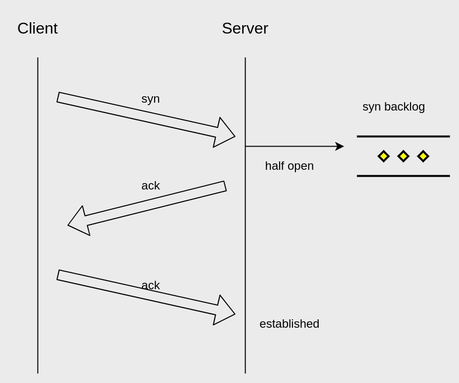
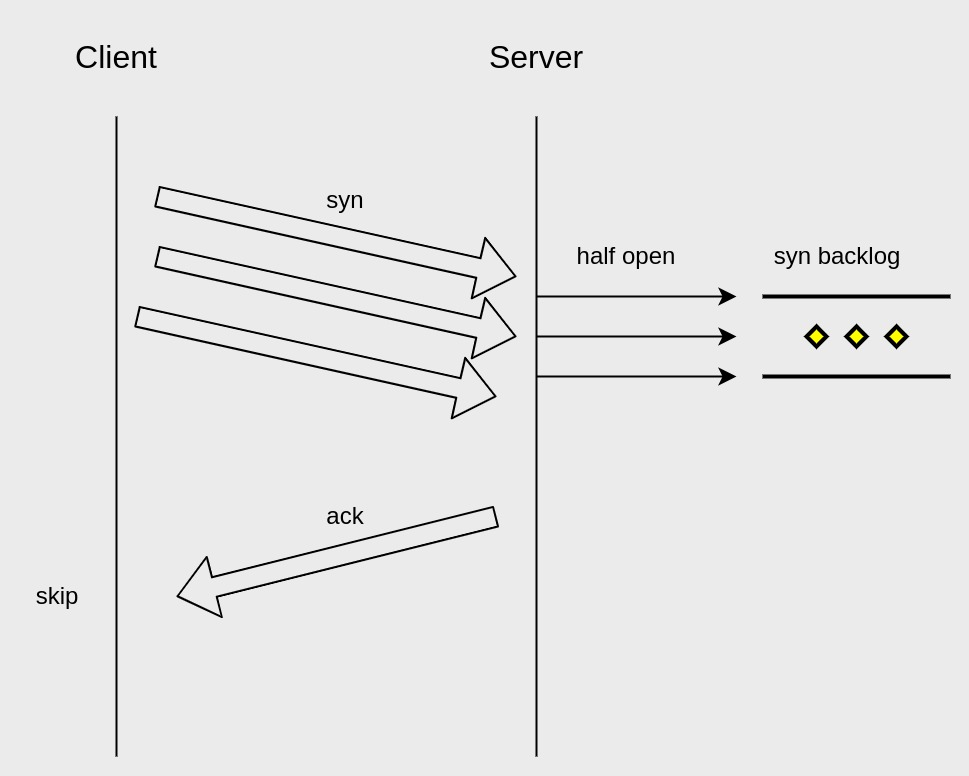

了解下如何避免TCP SYN flood —— DDoS的一种。

<!-- more -->

## 先了解TCP半连接以及backlog
tcp三次握手时，在服务端出现的一种tcp状态。连接的状态会被存入sync backlog中，等待Client ack后，状态sync backlog中出队。

## 认识TCP SYN flood attack？
Client恶意地发送大量sync，但不回应Server ack建立连接。

对于Server会有如下影响：
- syn backlog会打爆，因为其有长度限制，导致Server无法建立新连接，拒绝服务；
- Server会为syn backlog中的半连接重试ack，增加其cpu消耗，拖垮服务性能；

## 如何避免
- 开启SYN Cookie，它可以让服务器在收到客户端的SYN报文时，不分配资源保存客户端信息（即存储到syn backlog的信息），而是将这些信息保存在SYN+ACK的初始序号和时间戳中。对正常的连接，这些信息会随着ACK报文被带回来；（但它也有缺点，请查阅参考信息）
- 根据实际需求加大sync backlog；
- 减少sync ack的重试，避免消耗过多服务端cpu资源；
- 加多一层防护来扛流量，这一层性能很高／很能扛。

## 参考
- [enhancing tcp sync flood attack](https://www.ibm.com/docs/en/cic/1.1.0?topic=configuration-enhancing-tcp-syn-flood-attack)
- [sync cookies](https://en.wikipedia.org/wiki/SYN_cookies)
- [深入浅出TCP中的SYN-Cookies](https://segmentfault.com/a/1190000019292140)

